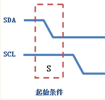
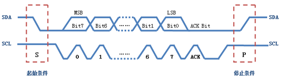

## 什么是 IIC ？

一种串行总线。两线。时钟线 SCL + 数据线 SDA。速率 400 kbps。

## IIC 通信帧

|            | 开始           | 发送数据                                  | 响应 | 接收数据 | 响应 | 结束           |
| ---------- | -------------- | ----------------------------------------- | ---- | -------- | ---- | -------------- |
| SDA 谁产生 | 主             | 主                                        | 从   |          |      | 主设备产生     |
| SDA        | 高-->低        | SCL 高电平期间传送bit，低电平期间数据变化 | 低   |          |      | 低-->高        |
| SCL        | 高-----------> | 时钟信号                                  |      |          |      | 高-----------> |
|            |                |                                           |      |          |      |                |

一个字节按数据位从高到低（MSB）传输完后，从设备将拉低 SDA 线，回传给主设备一个应答位