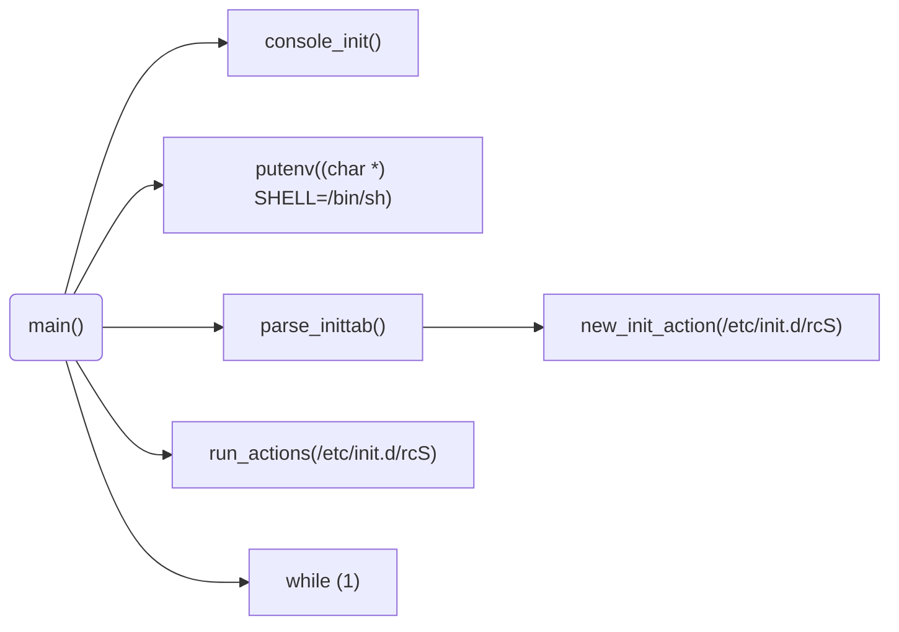

## 官网 源码

官网：https://busybox.net/

busybox-1.32.0.tar.bz2

## 编译 安装

见 INSTALL

## 源码分析

### init/init.c

通过分析 busybox 初始化流程，可以知道在两个地方可以定制初始化过程：/etc/inittab、/etc/init.d/rcS。

## 交叉编译

https://b23.tv/SVeL4R

[arm-linux-gcc4.4.3编译busybox-1.25.0](https://www.cnblogs.com/softhal/p/5769121.html)

## 参考

[随想录（被高估的busybox）](https://blog.csdn.net/feixiaoxing/article/details/80345233)