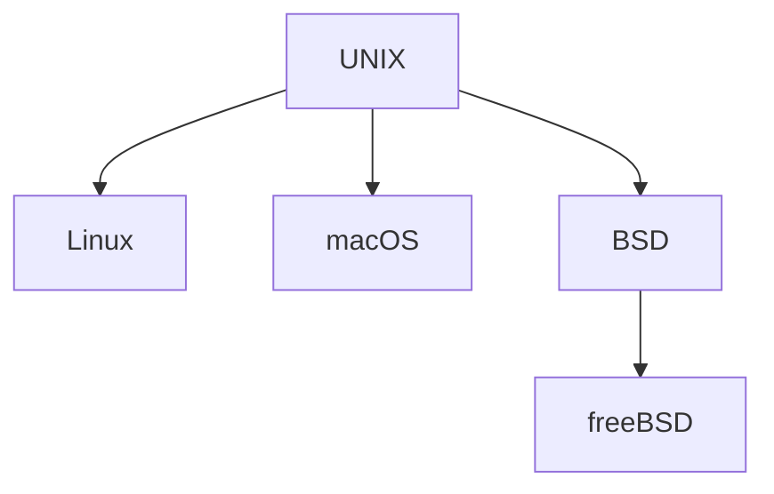

## # UNIX 与 Linux 发展史

关系：Unix 是父亲，Linux 是儿子。

> 1965年：Multics，MIT && GE && AT&T 联合开发，过于复杂，失败
>
> 1969年：Unix，肯·汤普森
>
> 1985年：Windows
>
> 1991年：Linux，Linus Torvalds（芬兰大学生）

1971年，C语言诞生，肯·汤普森 && 丹尼斯·里奇。使用 C语言重写 Unix。（早期的 Unix 是用汇编写的，可移植性非常差，CPU 一变，指令集一变，系统立马不能运行）

类 UNIX 操作系统

Linux 内核版本说明

2.6.18

主办本.次版本.末版本

次版本为偶数，代表是稳定版本。次版本为基数，代表为开发版本。（3.x.x 以前）

Linux 主要发行版本（都是使用的相同的 Linux 内核）

redhat 系列：

redhat、centOS、fedora、红旗 Linux（国内）、SuSE……

debian 系列

debian、ubuntu……

两系列主要区别：软件包安装方式不同；使用上几乎完全相同。因为都是使用的相同的 Linux 内核。

PS：

fedora 开发实验版

redhat 企业版，维护收取服务费

centOS 社区版，和 redhat 几乎一模一样

PS：

开源 ≠ 免费

## # 开源软件简介

开源软件：

Apache(图标: 羽毛)、nginx、MySQL、PHP(图标: 大象)、samba、mongoDB、python、ruby……

开源软件流行的原因

- 使用的自由
  - 绝大多数开源软件免费。但不是绝对，开源 ≠ 免费。开源软件也可以卖钱，即我把我的软件卖给你，同时给你源代码。甚至开源源代码，不开源注释，你花钱买我注释😂
- 研究的自由
  - 可以获得软件源代码
- 散布及改良的自由
  - 可以自由传播、改良甚至销售

## # Linux 应用领域

